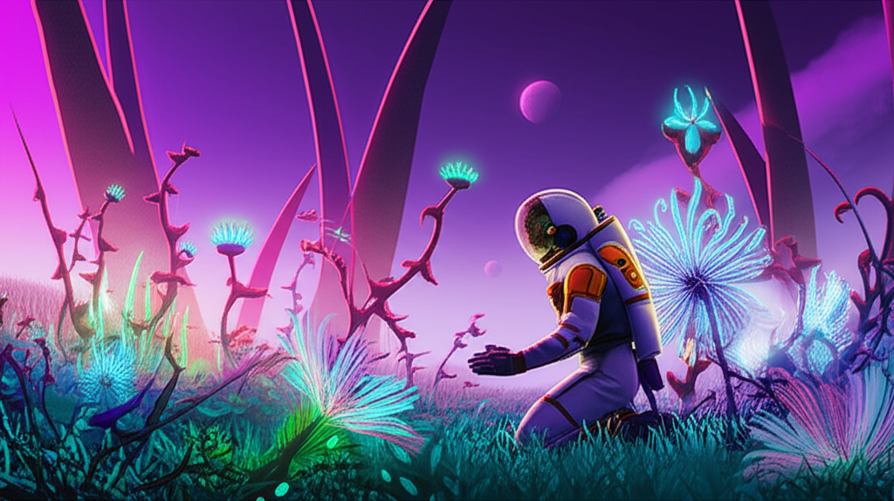

# 🖼️ GenAI Image Generator

A Streamlit app that generates images from text prompts using **Google Generative AI (Gemini 2.0)**.

---

## ✨ Features

- 🎨 Generate images based on user input text prompts  
- 💬 Displays AI-generated images and descriptive text  
- 🌗 Supports light and dark themes with a toggle  
- 📥 Allows downloading generated images in PNG format

---

## 🛠️ Tech Stack

- 🖥️ Streamlit  
- 🤖 Google GenAI API (Gemini 2.0 Flash Image Generation)  
- 🖼️ Pillow (PIL) for image processing

---
## 📂 Project Structure

```bash

├── img_gen.py               # Main Streamlit app
├── req.txt     # Python dependencies
├── image.png  # Output image (auto-generated)
└── README.md            # Project documentation
```
---

## ⚙️ Setup

1. Clone the repo:
    ```bash
    git clone https://github.com/HariJakku/Prompt-to-Pixel.git
    cd Prompt-to-Pixel
    ```

2. Create and activate a virtual environment (optional but recommended):
    ```bash
    python -m venv venv
    source venv/bin/activate  # Windows: venv\Scripts\activate
    ```

3. Install dependencies:
    ```bash
    pip install -r req.txt
    ```

4. Add your Google GenAI API key in `app.py`:
    ```python
    client = genai.Client(api_key="YOUR_API_KEY_HERE")
    ```

---

## ▶️ Running the App

```bash
streamlit run img_gen.py
```

## 📝 Sample Prompt & Output

**Prompt:**  
> "An astronaut discovering an alien garden on a distant planet."

**Generated Image:**  



---

## 📄 License

MIT License

---

## 👤 Author

**KUMARSWAMI Jakku**  
B.Tech Computer Science | AI Enthusiast | Full Stack Developer  
📧 harijakku2005@gmail.com  
🌐 [GitHub](https://github.com/HariJakku) | [LinkedIn](https://linkedin.com/in/hari-jakku-189921278/)

